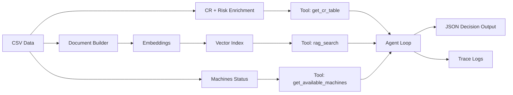

# MAMO Seed Dataset Orchestrator


A manufacturing orchestration agent that plans next-shift schedules using critical-ratio prioritization, supplier-risk data, and tool-calling RAG evidence to produce JSON actions.

## Highlights

- Critical ratio (CR) prioritization with supplier risk enrichment
- Tool-calling agent loop with trace logging
- RAG evidence over operational datasets
- JSON-only response for deterministic downstream automation

## Architecture



## Setup

1) Create a virtual environment (optional) and install dependencies:

```bash
pip install -r requirements.txt
```

2) Copy the example environment file and fill in values:

```bash
copy .env.example .env
```

Required environment variables:
- `AZURE_OPENAI_API_KEY`
- `AZURE_OPENAI_ENDPOINT`
- `AZURE_OPENAI_CHAT_MODEL`
- `AZURE_OPENAI_EMBED_MODEL`
- `AZURE_OPENAI_API_VERSION` (optional)

Optional: If you want to skip RAG/embeddings, you can disable the RAG tools in `src/main.py` and run with only the CR/machine tools.

## Run

```bash
python main.py
```

## Docker

```bash
docker build -t mamo-orchestrator .
docker run --rm --env-file .env mamo-orchestrator
```

## Project Structure

```
src/
	clients.py
	config.py
	data.py
	main.py
	prompts.py
	rag.py
tests/
	test_data.py
```

## Contributing

See CONTRIBUTING.md.

## Production Considerations

- Store secrets in a managed vault (not in .env for production).
- Add authentication and authorization around any exposed endpoints.
- Add retries, circuit breakers, and timeouts for external calls.
- Implement monitoring/tracing for agent steps and tool calls.
- Validate and sanitize all inputs/outputs.

## Limitations

- Requires valid Azure OpenAI credentials.
- Demo dataset only; not intended for real production scheduling.

## License

MIT

## Notes

- Audit logs are written to `artifacts/audit_logs/`.
- The `.conda/` directory is excluded from source control.
